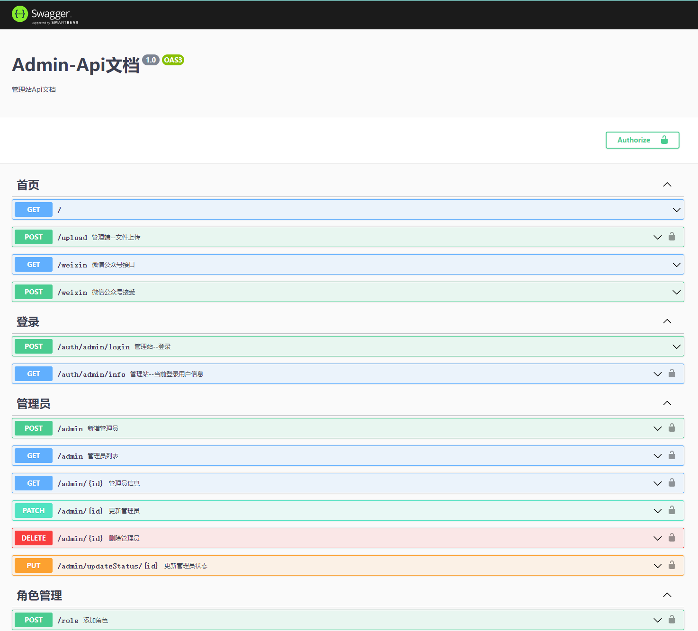
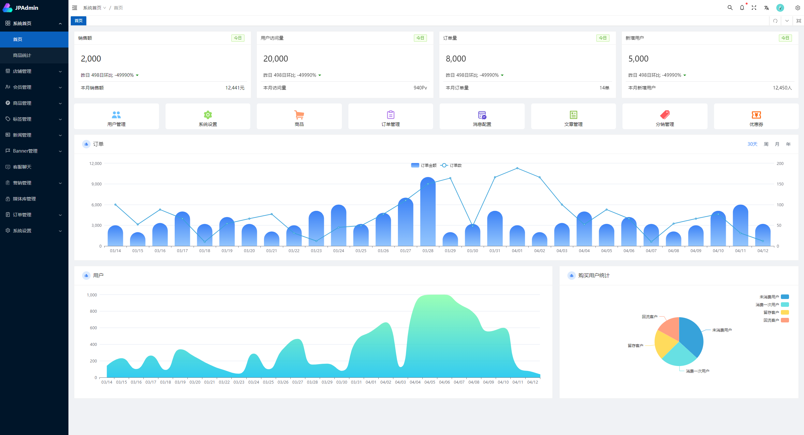

<!--
 * @Author: xuanyu
 * @LastEditors: xuanyu
 * @email: 969718197@qq.com
 * @github: https://github.com/z-xuanyu
 * @Date: 2022-03-03 11:46:30
 * @LastEditTime: 2022-07-05 16:53:09
 * @Description: Modify here please
-->

## XYMALL 商城-NestJs-Api

XYMALL 商城 Api 服务端，项目集成 Nestjs+Mongodb+Jwt 等。项目是前后端分离，分为四端：Api 服务端，Admin 管理端，Web 前端(uniapp),PC 端（Nuxt3）

Admin 端仓库：<a href="https://github.com/z-xuanyu/xy-mall-admin">点击跳转</a> Web 端 uniapp 仓库：<a href="https://github.com/z-xuanyu/xy-mall-uni">点击跳转</a> PC 端仓库：<a href="https://github.com/z-xuanyu/xy-mall-pc">点击跳转</a>

### 项目说明

为了迭代更多功能，方便管理，使用 Nestjs monorepo 模式, 什么是 monorepo 模式，推荐去官网文档看，获取下面推荐的中文文档，我们这里把服务端 Api,分为两个项目来开发，一个是 admin-api,一个是 web-api, admin-api 只要是管理 Admin 站接口开发，web-api 只要是负责 web 站 api 接口开发。

在 Nestjs 中创建多个子项目也非常简单。首先全局安装一下 Nest-cil,详细 cli 使用，可以去阅读官网文档。如果对 nestjs 不熟悉，推荐看下面资源。

### 推荐 Nestjs 学习资源

- Nestjs 中文文档：<a href="https://docs.nestjs.cn/">点击跳转</a>
- B 站 UP 主-全栈之巅：<a href="https://space.bilibili.com/341919508/">点击跳转</a>

### 演示：

swagger 文档 <a href="https://fukucho-api.zhouxuanyu.com/api-docs/">（点击跳转）</a>  Admin 端演示地址：<a href="http://fukucho-admin.zhouxuanyu.com">（点击跳转）</a>



#### 如何创建 Nestjs 子项目

```bash
 $ nest g app [project-name]
```

例如：nest g app admin

创建完成之后你会看到项目合并为 apps 目下。apps 目录下就是所有子目录。

### 项目目录结构

```bash
├── .husky                     # 项目Git提交规范
├── apps                       # 项目容器
│   │── admin                  # admin端
│   └── web                    # web端
├── libs                       # 公共模块与配置
│   │── common                 # 公共模块
│   └── db                     # 数据库相关
├── .prettierrc                # prettierrc 配置项
├── .eslintrc.js               # eslint 配置项
├── tsconfig.json              # TypeScript配置
├── commitlint.config          # 代码提交规范
├── nest-cli                   # nest cli 配置
└── package.json               # package.json
```

每个子项目都是相同的目录结构,这里是按官方脚手架（nest-cli）推荐生成的。例如开发 user 一个模块，使用官方 nest-cli 生成 Restful 风格 api，那么就执行下面命令(注意：记得全局安装 nest-cli)

```bash
$ nest g res user
```

生成如下： 

user 模块的 serivice controller modules dto 还有一些单元测试。都归纳再 user 目录下。推荐使用此方式。

### 功能模块

Admin 端

- [x] 管理员模块(已完成)
- [x] 权限角色模块(已完成)
- [x] 商品管理模块(已完成)
- [x] 会员模块(已完成)
- [x] Banner 模块(已完成)
- [x] 素材库模块(已完成)
- [x] 分类模块(已完成)
- [x] 标签模块(已完成)
- [x] 新闻模块(已完成)
- [x] 站点设置模块(已完成)
- [ ] 优惠券模块(开发中...)

Web(uniapp)端

- [x] 首页数据接口(已完成)
- [x] 商品相关接口(已完成)
- [x] 用户相关接口(已完成)
- [x] 购物车相关接口(已完成)
- [x] 订单相关接口(已完成)

### 项目启动

1、先克隆项目

```bash
$ git clone https://github.com/z-xuanyu/xy-mall-api.git
```

2、安装项目依赖

```bash
$ yarn 或者 npm install 或者pnpm install
```

3、设置数据数据库链接字符串，文件目录在：<span style="color: red">libs/common/config/src/db.confug.ts</span> , 把里面链接替换成自己数据库信息，注意：先安装配置好 Mongodb 数据库，项目默认设置密码链接，建议大家配置密码链接数据库，详细配置<a href="https://www.zhouxuanyu.com/archives/88.html">点击查看配置教程</a>，如果想不想配置密码链接字符串，请修改链接字符串为：mongodb://127.0.0.1:27017/[数据库名]，

4、修改项目启动端口,文件目录在: <span style="color: red">libs/common/config/src/port.config.ts</span>, 项目有分 admin 端，web 端，需要设置两个不同端口，这里默认 admin 端：3008， web 端：3009。需要修改自行修改。

5、修改项目 jwt 秘钥与失效时间。文件目录在：<span style="color: red">libs/common/config/src/jwt.config.ts</span>, 默认 jwt 失效时间 1 天。

6、初始化数据库，脚本未写好，请先导入备份数据库文件 backup/nest-js.sql, 导入数据库可以用个 Navicat Premium 工具等

###### 初始化完成之后 Admin 端的默认最高权限管理员账 号：xuanyu@qq.com 密码：123456

7、运行项目

```bash
# 开发环境 Amdin端
$ npm run start:admin-dev

# 开发环境 Web端
$ npm run start:web-dev

# 生产环境 mode Admin端
$ npm run start:admin-prod

# 生产环境 mode web端
$ npm run start:admin-prod
```

8、项目运行完成之后，会看到控制台有输出 swagger 接口文档 api 地址，例如：http://localhost:3008/api-docs

### 打包项目

```bash
# Amdin端
$ npm run build:admin

# Web端
$ npm run build:web

```

## License

Nest is [MIT licensed](LICENSE).
